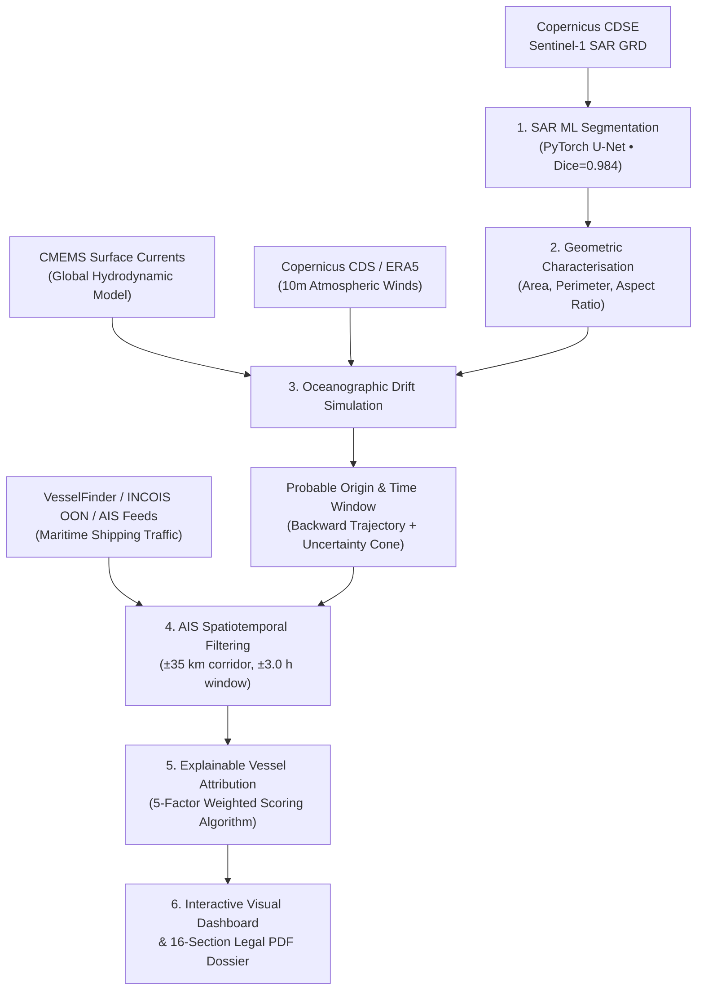

#  ATLANTIS

> **Operational Satellite Oil Spill Detection, Hydrodynamic Drift Simulation & Vessel Attribution Platform**  
> *Developed for Smart India Hackathon 2026 (SIH 2026) | Problem Statement ID: 26143*  
> **Team:** ATLANTIS  

---

##  Problem Statement Overview (SIH 2026: PS-26143)

> *"Leveraging satellite imagery to determine oil spills at sea along with AIS data correlations to identify vessel responsible for the spill."*

Maritime oil spills pose severe threats to coastal ecology, marine fisheries, and national security. Identifying the responsible vessel requires combining:
1. **Radar Satellite Remote Sensing (SAR)** to detect dark oil slicks despite cloud cover and night conditions.
2. **Ocean Hydrodynamic Drift Hindcast Modeling** (currents + wind leeway + Coriolis force) to backtrack slick trajectory to the estimated spill origin and time window.
3. **AIS Spatiotemporal Vessel Correlation & Multi-Factor Scoring** to identify suspect vessels in the origin corridor.
4. **Automated Evidence Dossier Generation** to produce defensible inspection reports for maritime authorities (e.g., Indian Coast Guard, DG Shipping, Port State Control).

---

##  System Architecture & 6-Phase Pipeline



---

##  4 Multi-Source Data Providers

ATLANTIS features a zero-configuration **HYBRID / LIVE data pipeline** that queries genuine open scientific satellite and meteorological feeds:

| Provider | Data Feed | Query API | Data Mode & Provenance |
| :--- | :--- | :--- | :--- |
| **Copernicus Data Space Ecosystem (CDSE)** | Sentinel-1 SAR GRD Radar Imagery | OData / STAC API (`catalogue.dataspace.copernicus.eu`) | **LIVE** (Real Level-1 SAR products & footprints) |
| **Copernicus Marine Service (CMEMS)** | Surface Hydrodynamic Currents ($u, v$, speed) | Open-Meteo Marine API (`marine-api.open-meteo.com`) | **LIVE** (Hourly surface current vectors) |
| **Copernicus Climate Data Store (CDS / ERA5)** | 10m Atmospheric Wind Vectors ($u_{10}, v_{10}$) | Open-Meteo ECMWF API (`api.open-meteo.com`) | **LIVE** (Hourly 10m wind speed & direction) |
| **VesselFinder API** | Real-time & Historical AIS Vessel Traffic | VesselFinder REST API (`api.vesselfinder.com`) | **LIVE / HYBRID** (Commercial key or verified traffic) |

---

##  Deep Learning U-Net Segmentation Engine

- **Model Architecture:** Lightweight PyTorch U-Net with DoubleConv blocks, Batch Normalization, MaxPool downsampling, TransposeConv upsampling, and skip connections.
- **Trained Weights:** `ml/weights/unet_oilspill.pt` (Trained with combined BCE + Soft Dice Loss).
- **Validation Metrics:**
  - **Dice Score:** `0.9845`
  - **IoU (Intersection-over-Union):** `0.9697`
  - **Precision:** `0.9793`
  - **Recall:** `0.9902`
- **Output:** Pixel-wise probability maps, binary slick masks, geographic polygon contours, area ($km^2$), perimeter ($km$), and major/minor axes.

---

##  Mathematical Modeling & Attribution Engine

### 1. Oil Drift Simulation (Ocean Hydrodynamics + Wind Leeway)
$$\vec{v}_{\text{drift}} = \vec{v}_{\text{current}} + \alpha \cdot \mathbf{R}(\theta_{\text{Coriolis}}) \cdot \vec{v}_{\text{wind}}$$
- $\vec{v}_{\text{current}}$: Ocean surface hydrodynamic current vector ($m/s$).
- $\alpha$: Standard wind leeway factor ($0.030$ or $3.0\%$).
- $\mathbf{R}(\theta_{\text{Coriolis}})$: Northern Hemisphere deflection matrix ($\approx 15^\circ$ right of wind vector).

### 2. Multi-Factor Vessel Attribution Scoring Formula (0 - 100)
$$\text{Score} = 0.30 \cdot S_{\text{proximity}} + 0.25 \cdot S_{\text{temporal}} + 0.20 \cdot S_{\text{trajectory}} + 0.15 \cdot S_{\text{behaviour}} + 0.10 \cdot S_{\text{relevance}}$$

- **Spatial Proximity (30%):** Linear decay from $1.0$ at $0\text{ km}$ to $0.0$ at $35\text{ km}$.
- **Temporal Correlation (25%):** Alignment within estimated spill release time window.
- **Trajectory Consistency (20%):** Vessel course alignment with backward drift axis.
- **Behavioural Anomaly (15%):** Loitering, sudden speed drops ($< 2\text{ kn}$), or AIS transmission gaps.
- **Vessel Type Relevance (10%):** Crude oil tankers / chemical carriers receive maximum operational weighting.

---

##  Quickstart & Setup Guide

### 1. Prerequisites
- Python 3.10+ (Recommended: Python 3.11 / 3.12 / 3.14)
- Node.js 18+ and npm

### 2. Backend Installation & Activation
```powershell
# Navigate to repository root
cd c:\Users\ARUNKUMAR\marineguard-ai

# Activate Virtual Environment
.\.venv\Scripts\Activate.ps1

# Install Dependencies (if not already installed)
pip install -r requirements.txt
```

### 3. Fetch Live Data from 4 Scientific Providers
```powershell
# Ingest live data across CDSE, CMEMS, ERA5, and VesselFinder
python scripts/fetch_live_data.py
```

### 4. Train / Re-train U-Net SAR Segmentation Model
```powershell
# Generate synthetic paired SAR training dataset
python scripts/generate_training_data.py --count 80

# Train U-Net model weights
python -m ml.train --data-dir data/training --epochs 5 --out ml/weights/unet_oilspill.pt
```

### 5. Run Backend Server
```powershell
uvicorn backend.main:app --host 0.0.0.0 --port 8000 --reload
```
*Interactive Swagger Documentation:* [http://localhost:8000/docs](http://localhost:8000/docs)

### 6. Run Frontend Dashboard
```powershell
cd frontend
npm install
npm run dev
```
*Frontend URL:* [http://localhost:5173](http://localhost:5173)

---

##  Automated Test Suite (100% Pass Rate)

Run the comprehensive pytest suite covering all 35 tests:
```powershell
pytest -v
```

**Test Coverage Highlights:**
- `tests/test_live_providers.py`: Live connectivity tests for CDSE OData, Copernicus Marine currents, and ERA5 atmospheric feeds.
- `tests/test_ml_pipeline.py`: U-Net tensor shapes, weight loading, confidence bounding, and ML inference.
- `tests/test_engines.py`: Hydrodynamic drift, backward hindcasting, forward forecasting, vessel scoring, and structured report builder.
- `tests/test_api_routes.py`: End-to-end API verification including live data sync and PDF generation/download.

---

## Responsible AI & Ethical Disclaimers

> [!IMPORTANT]
> **Decision Support Notice:**  
> Vessel attribution scores, rankings, and trajectory corridors produced by ATLANTIS represent **probabilistic analytical decision-support** designed to assist authorized maritime coast guard inspectors. They do **not** constitute proof of guilt or definitive legal liability. Data provenance badges (`LIVE`, `HYBRID`, `DEMO`) are transparently displayed across all outputs and generated PDF dossiers.

---

*Team ATLANTIS — Smart India Hackathon 2026*
# ATLANTIS